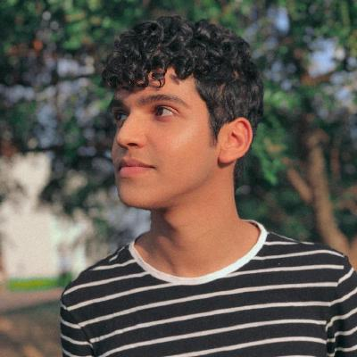

# Telegram

## Sobre o Projeto

Repositório destinado à disciplina de [Requisitos](https://requisitos-de-software.github.io/2020.2-Telegram/) de Software da Universidade de Brasília acerca do Telegram. Reserva-se a armazenar e apresentar os artefatos e processos desenvolvidos na disciplina, tais como Pré-Rastreablidade, Elicitação, Modelagem, Análise e Pós-Rastreabilidade para que sejam levantados os requisitos não funcionais e funcionais da aplicação.

## Equipe

| Nome                                                                               | Matrícula  | GitHub                             | Email                        |
| ---------------------------------------------------------------------------------- | ---------- | ---------------------------------- | ---------------------------- |
|   | 18/0041444 | [@brendavsantos][brenda-github]    | brendasantosv.bs@gmail.com   |
|   | 18/0033034 | [@herickport][herick-github]       | herick.portugues@gmail.com   |
|    | 18/0113666 | [@alvesitalo][italo-github]        | italooko@gmail.com           |
|  | 18/0113992 | [@lorranyoliveira][lorrany-github] | lolo.souza80@yahoo.com       |
|     | 18/0114093 | [@lboaventura25][lucas-github]     | lucasxboaventura@hotmail.com |
|    | 18/0114689 | [@tsrrodrigues][tiago-github]      | tsrrodrigues@outlook.com     |

[brenda-github]: https://github.com/brendavsantos
[herick-github]: https://github.com/herickport
[italo-github]: https://github.com/italooko@gmail.com
[lucas-github]: https://github.com/lboaventura25
[lorrany-github]: https://github.com/lorranyoliveira
[tiago-github]: https://github.com/tsrrodrigues

<b>Grupo 3</b>

Requisitos de <i>Software</i>   

## Rodar localmente

### Dependências

- [docker](https://docs.docker.com/get-docker/)
- [docker-compose](https://docs.docker.com/get-docker/)

### Comandos

- Para compilar:
<pre><code>docker-compose build</code></pre>

- Para rodar:
<pre><code>docker-compose up</code></pre>

- Acesse a url local http://0.0.0.0:8000/
