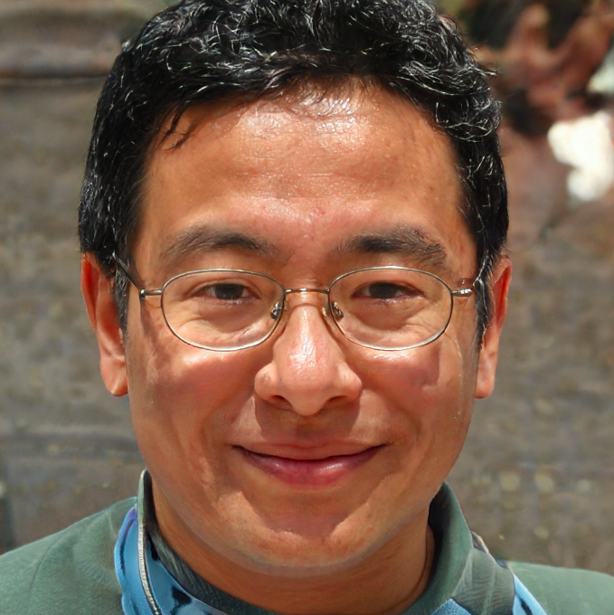
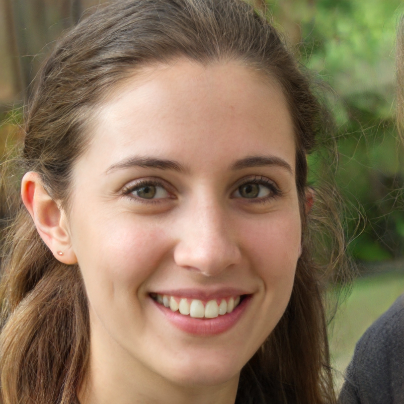
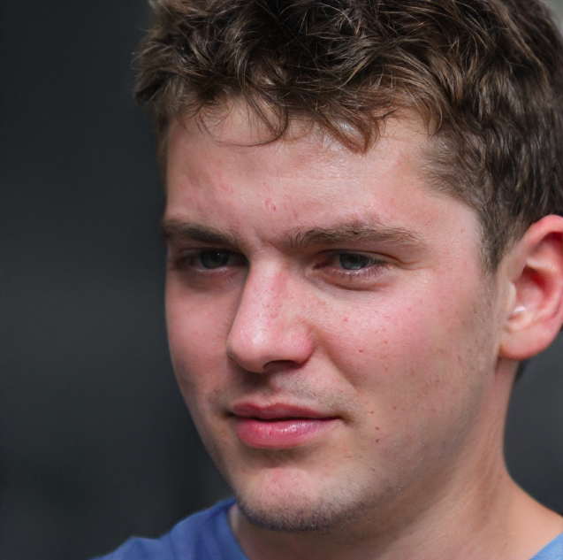
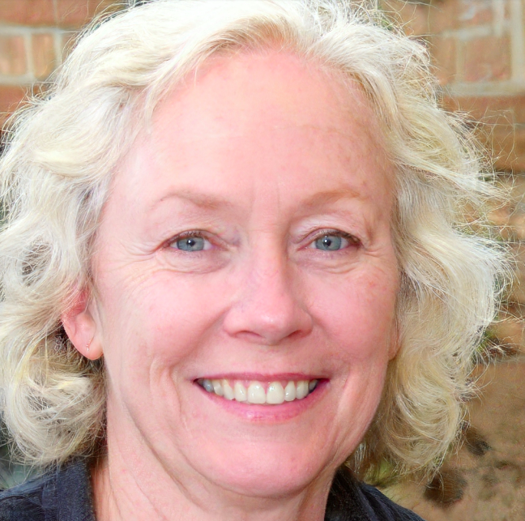

# Personas

## Metodologia

&emsp; Uma persona é um personagem fictício criado para descrever um usuário típico de um sistema. A técnica é muito utilizada para manter todos focados em um mesmo alvo - o grupo de usuários - durante discussões de design e desenvolvimento.

## Participantes

- Hérick Portugues
- Tiago Samuel

## Resultado

### **Persona:** Bruno Saito, Engenheiro de Software

<figcaption>Figura 1. Foto de Bruno¹</figcaption>

- Idade: 37 anos
- Sexo: Masculino
- Escolaridade: Ensino Superior
- Profissão: Engenheiro de Software
- Renda mensal: R$15.000
- Ramo de atuação: Tecnologia
- Região de moradia: Distrito Federal

&emsp; Bruno tem 37 anos, é engenheiro de software e trabalha em uma empresa de grande porte que fornece serviços de tecnologia da informação. É natural de Brasília, possui 1 filho e é casado. Bruno trabalha em uma empresa com funcionários de todo o Brasil e sua comunicação com todos é apenas de forma remota. Ele precisa de uma comunicação eficiente com sua equipe e com seus clientes para que possa gerenciar os projetos em que trabalha. Ele é experiente em sua área de atuação e usa de seus canais de comunicação para delegar tarefas e ter status sobre o andamento dos projetos e por isso necessita de um meio de comunicação de fácil acesso no dia a dia, como um aplicativo, e que possa distribuir mensagens para várias pessoas de uma vez.

### **Persona:** Letícia Gomes, Estagiária de Computação

<figcaption>Figura 2. Foto de Letícia¹</figcaption>

- Idade: 22 anos
- Sexo: Feminino
- Escolaridade: Ensino Superior Incompleto
- Profissão: Cientista da Computação
- Renda mensal: R$1.200
- Ramo de atuação: Tecnologia
- Região de moradia: Mato Grosso do Sul

&emsp; Letícia tem 22 anos, estuda Ciência da Computação e é estagiária de uma startup que fornece serviços de regulação. Devido à pandemia, tanto a faculdade como o estagio de Letícia passaram a adotar o sistema remoto. Letícia possui muitas disciplinas que demandam trabalho em equipe (em razão de estar na metade final do curso) e isso, aliado ao seu estagio, faz com ela precise se comunicar regularmente com suas equipes de forma remota. Ela utiliza bastante de seus canais de comunicação para discutir soluções relacionadas aos projetos e por isso necessita de um meio de comunicação intuito e que possa enviar mensagens em grupo.

### **Persona:** Pedro Henrique, Estudante de Direito

<figcaption>Figura 3. Foto de Pedro Henrique¹</figcaption>

- Idade: 18 anos
- Sexo: Masculino
- Escolaridade: Ensino Superior Incompleto
- Profissão: Estudante
- Renda mensal: Não possui
- Ramo de atuação: Direito
- Região de moradia: São Paulo

&emsp; Pedro tem 18 anos e acabou de ingressar no curso de Direito na Faculdade de São Paulo. Ele é natural do Paraná, mas se mudou para São Paulo, após completar o ensino médio, para seguir o sonho de cursar Direito em uma faculdade pública. Pedro sempre se deu muito bem com seus amigos de escola e quer continuar a manter contato com eles mesmo à distância. Ele precisa de uma maneira de interagir com seus amigos, tanto individualmente como em grupo, para se. manter atualizado sobre novidades e também compartilhar com seus amigos um pouco de sua nova vida na maior cidade do país, e por isso necessita de uma ferramenta de comunicação gratuita e de fácil acesso em seu pelo celular, para enviar mensagens e/ou fazer chamadas.

### **Antipersona:** Cláudia Diaz, Arquiteta Aposentada

<figcaption>Figura 3. Foto de Cláudia¹</figcaption>

- Idade: 52 anos
- Sexo: Feminino
- Escolaridade: Ensino Superior
- Profissão: Aposentada
- Renda mensal: R$7.000
- Ramo de atuação: Construção Civil / Aposentada
- Região de moradia: Paraná

&emsp; Cláudia possui 52 anos e é uma arquiteta aposentada. Decidiu parar de trabalhar devido à idade e para aproveitar sua família. Gosta de viajar para lugares remotos onde, geralmente, não há internet. Não é muito apegada à tecnologia, mesmo tendo utilizado algumas ferramentas em seus anos de trabalho. Gosta de se comunicar pessoalmente em vez de utilizar um chat. E quando viaja gosta de realizar ligações para manter contato. Cláudia é uma anti-persona e o aplicativo Telegram não é destinado à ela.

## Referências Bibliográficas

- BARBOSA, Simone; SILVA, Bruno. Interação Humano-Computador: Cap. 6 – Organização do Espaço de Problema.
- ¹This Person Does Not Exist. Disponível em: <https://thispersondoesnotexist.com/>. Acesso em: 10 maio 2021.¹

## Versionamento

|    Data    | Versão |          Descrição           |            Autor(es)            |
| :--------: | :----: | :--------------------------: | :-----------------------------: |
| 10.03.2021 |  1.0   |     Criação das personas     | Hérick Portugues e Tiago Samuel |
| 11.03.2021 |  1.1   | Desenvolvimento do documento |        Hérick Portugues         |
| 30.04.2021 |  1.2   |     Revisão do documento     |           Ítalo Alves           |
