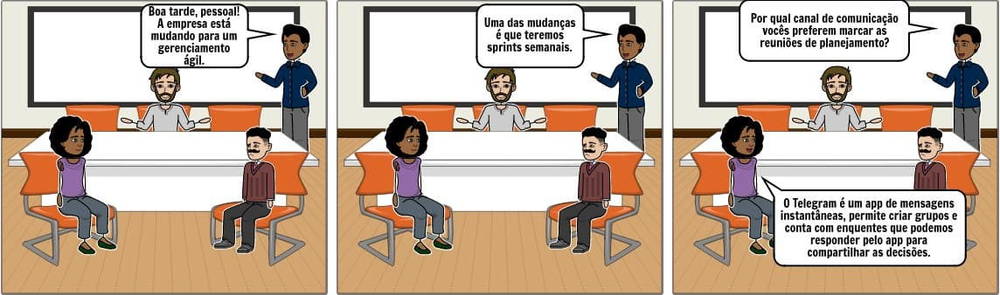
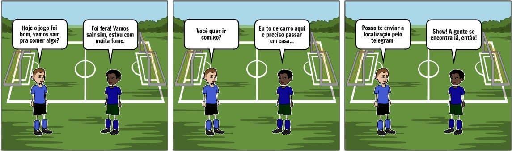
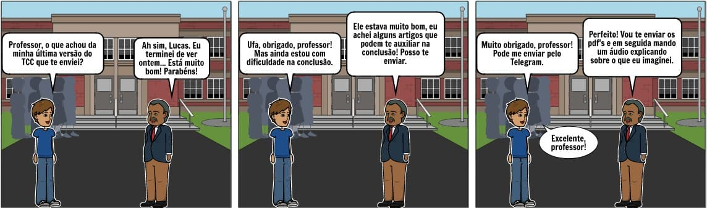

# Storytelling

## Metodologia

&emsp; Storytelling é um termo em inglês, que significa <em>contar história</em>. Pode ser definda como uma técnica de elicitação de requisitos que tem como principal característica a criação de uma ou mais histórias que ilustram as necessidades do usuário de forma que seja possível notar as ações do cotidiano e perceber as principais necessidades que o sistema deverá atender, empregando sempre técnicas de contagem de histórias motivadoras com uma linguagem simples durante o processo de construção.

&emsp;Devido ao cenário atual de ensino remoto, a técnica oferece facilidade em sua realização pois não necessita que todos os participantes estejam no mesmo lugar, nem presentes ao mesmo tempo.

## Participantes
- Brenda Santos
- Lucas Boaventura

## Resultado

&emsp; Foram feitas <strong>três histórias</strong> que retratam alguns exemplos de uso dos usuários, que estão sendo exibidas nas figuras 1, 2 e 3. Por conseguinte, foram elicitados alguns requisitos para o aplicativo do Telegram.

<figcaption>Figura 1. Imagem demonstrativa da 1ª história, onde foram encontrados 3 requisitos: envio de mensagens, criação de enquetes e criação de grupos.</figcaption>

<figcaption>Figura 2. Imagem demonstrativa da 2ª história, onde foi encontrado 1 requisito: compartilhar localização.</figcaption>

<figcaption>Figura 3. Imagem demonstrativa da 3ª história, onde foram encontrados 2 requisitos: envio de arquivos e áudios.</figcaption>

  | Número  |                                   Requisitos                                   |  
  | :-----: |  :------------------------------------------------------------------------:    |
  |    1    | O sistema deve permitir o envio de mensagens.                                  |
  |    2    | O sistema deve permitir o envio de arquivos                                    |
  |    3    | O sistema deve permitir a criação de grupos.                                   |
  |    4    | O sistema deve permitir a criação de enquetes.                                 |
  |    5    | O sistema deve permitir compartilhar localização.                              |
  |    6    | O sistema deve permitir o envio de áudios.                                     |

## Referências Bibliográficas
- SERRANO, Maurício; SERRANO, Milene; Requisitos - Aula 07;
- BOULILA, Naoufel; HOFFMANN, Anne; HERRMANN, Andrea. Using Storytelling to record requirements: Elements for an effective requirements elicitation approach. In: 2011 Fourth International Workshop on Multimedia and Enjoyable Requirements Engineering (MERE'11). IEEE, 2011. p. 9-16.
- JÄNTTI, Marko et al. Exploring the role of IT service management and IT service governance within IT governance. In: 2014 11th International Conference on Service Systems and Service Management (ICSSSM). IEEE, 2014. p. 1-6.

## Versionamento
|   Data   | Versão |        Descrição        |            Autor(es)           |
| :------: | :----: | :---------------------: | :----------------------------: |
|03.03.2021|   1.0  |Criação e desenvolvimento do documento|Brenda Santos e Lucas Boaventura|
|03.03.2021|   2.0  |Adiciona legenda nas imagens e tabela de requsitos                         |Lucas Boaventura                                |
