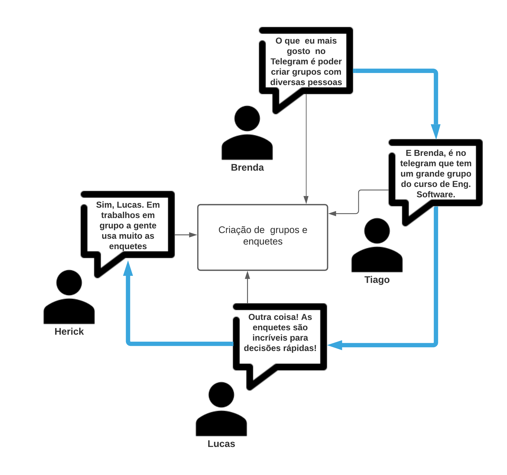
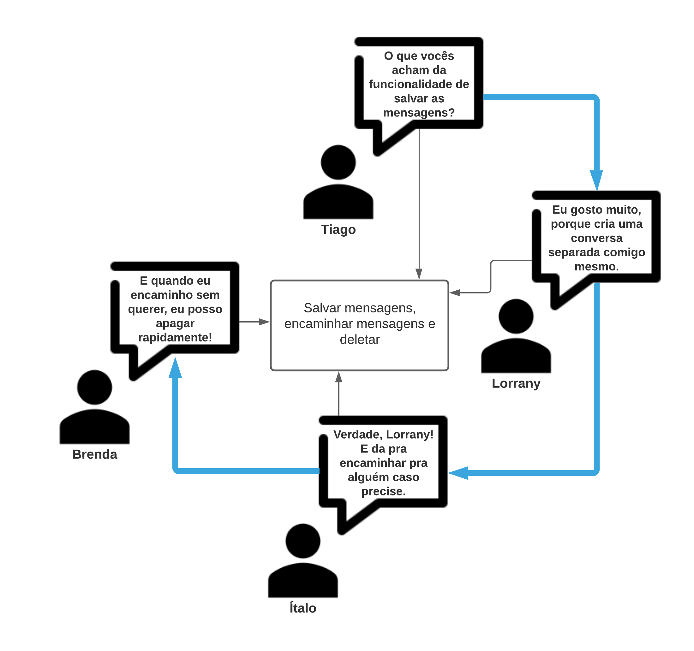

# Análise de Discurso 
## Metodologia

 
&emsp;A análise de discurso é uma técnica de elicitação de requisitos que é e realizada através da observação e interpretação de conversas entre grupos de usuários, de forma que seja possível identificar possíveis requisitos por meio dos tópicos mediados. Essa técnica pode ser desenvolvida utilizando alguns métodos de organização/mediação como a análise de conversação, turntaking ou pares adjacentes, variando de acordo com a quantidade de participantes a forma que a mediação é feita ou não e a alternância que deverá acontecer entre a fala dos participantes.

&emsp;Dentre as três possibilidades de realização da técnica, que são: Análise de conversação, turntaking ou pares adjacentes, a análise de discurso junto da análise de conversação foi o método escolhido. Em específico na aplicação desse método, as tarefas durante a conversa entre os stakeholders são designadas para uma única pessoa, que deverá: 

  - Identificar as ideias expostas;
  - Identificar as novas funcionalidades;
  - Identificar requisitos;
  - Identificar melhorias;
  - Identificar problemas;
  - Identificar sugestões. 

## Participantes

  - Brenda Santos
  - Hérick Portugues
  - Ítalo Alves
  - Lorrany Oliveira
  - Lucas Boaventura
  - Tiago Rodrigues

## Resultado

&emsp; As ilustrações abaixo representam parte das conversas registradas para o desenvolvimento da técnica, porém de forma meramente ilustrativa pois o grupo inteiro estava presente durante a reunião. O tema da conversa foi: <strong>Funcionalidades já existentes no aplicativo</strong>.

O resultado da reunião foram a elicitação das seguintes funcionalidades: 

<figcaption>Figura 1. Imagem demonstrativa da 1ª roda de conversa, onde foram encontrados 2 requisitos: Criação de grupos e criação de enquetes.</figcaption>

<figcaption>Figura 2. Imagem demonstrativa da 2ª roda de conversa, onde foram encontrados 3 requisitos: salvar mensagens, encaminhar mensagens e deletar mensagens.</figcaption>

**Funcionalidades**: 

  - Envio de mensagens (de texto, áudio, arquivo, localização, música, gifs e stickers)      
  - Realizar chamadas de voz e/ou vídeo   
  - Criação de grupos   
  - Criação de enquetes    
  - Salvar mensagens   
  - Encontrar pessoas próximas   
  - Pesquisar usuários e mensagens    
  - Covidar amigos    
  - Encaminhar e deletar mensagens    
  - Botfather     
  - Alternar entre contas no mesmo dispositivo    
  - Controle de frequência de mensagens enviadas em grupos   

  | Número  |                                   Requisitos                                   |  
  | :-----: |  :------------------------------------------------------------------------:    |
  |    1    | O sistema deve permitir o envio de mensagens.                                  |
  |    2    | O sistema deve permitir a realização de chamadas de voz/vídeo.                 |
  |    3    | O sistema deve permitir a criação de grupos.                                   |
  |    4    | O sistema deve permitir a criação de enquetes.                                 |
  |    5    | O sistema deve permitir que mensagens sejam salvas.                            |
  |    6    | O sistema deve permitir o envio de participação a amigos.                      |
  |    7    | O sistema deve permitir o encaminhamento e deleção de mensagens.               |
  |    8    | O sistema deve permitir a utilização e configuração de bots.                   |
  |    9    | O sistema deve permitir a alternância de contas por meio do mesmo dispositivo. |
  |    10   | O sistema deve permitir o controle da frequência de mensagens que podem ser enviadas nos grupos. |

## Referências Bibliográficas

- SERRANO, Maurício; SERRANO, Milene; Requisitos - Aula 07;

## Versionamento
|   Data   | Versão |        Descrição              |            Autor(es)           |
| :------: | :----: |    :---------------------:    | :----------------------------: |
|08.03.2021|   0.1  |  Criação do documento         |        Brenda Santos           |
|11.03.2021|   1.0  |  Desenvolvimento do documento | Brenda Santos, Lucas Boaventura|
|          |        |                               |                                |