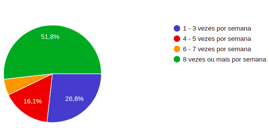

# Questionário

## Metodologia

&emsp;Essa técnica como o próprio nome diz, é feito a elicitação de requisitos por meio de um questionário. O questionário possui um conjunto de questões, com o objetivo de conhecer melhor as pessoas para saber qual a possível relação dela com o produto 

## Participantes
- Italo Alves
- Lorrany Oliveira

## Resultado

 O componente do grupo, Italo, elaborou um pequeno questionário com 8 perguntas, o qual foi disponibilizado para um conjunto de pessoas, segue abaixo o resultado: 

### 1- Qual o gênero sexual?

### 2- Qual a idade? 

### 3- Você utiliza o aplicativo Telegram?

### 4- Com qual frequência você utiliza o Telegram?

### 5- Você utiliza o Telegram para fins de:

### 6- Quais dessas funcionalidades você mais utiliza no Telegram?

### 7- Quais dessas funcionalidades você já utilizou?

### 8- Você acha o Telegram melhor que os aplicativos concorrentes?

## Referências Bibliográficas
- VALQUEZ, Carlos Eduardo; SIMÕES, Guilherme Siqueira. Engenharia de Requisitos. 

## Versionamento
|   Data   | Versão |        Descrição        |            Autor(es)           |
| :------: | :----: | :---------------------: | :----------------------------: |
|11.03.2021|   1.0  |Criação e desenvolvimento do documento|Lorrany Oliveira|
|          |        |                         |                                |
