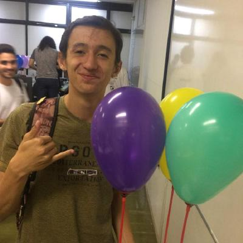

# Sobre
Este repositório é destinado ao projeto de Requisitos de Software do Grupo 3, que escolheu o aplicativo Telegram. Ele contém toda a documentação do projeto da disciplina, ministrado pelo professor André Barros, na Universidade de Brasília - Gama, durante o período 2020/2.

   O Telegram é um aplicativo de mensagens instantâneas baseado na nuvem. Os usuários podem fazer chamadas com vídeo, enviar mensagens e trocar fotos, vídeos, autocolantes e arquivos de qualquer tipo.

<h2 style="color: #011640; text-align: center"> Equipe</h2>

<a class="pessoa" href="https://github.com/brendavsantos">
  

    
  

  <h4 class="legenda">Brenda Santos</h4>
</a>
<a class="pessoa" href="https://github.com/danieldagerom">
  

    
  

  <h4 class="legenda">Daniel Primo</h4>
</a>
<a class="pessoa" href="https://github.com/herickport">
  

    
  

  <h4 class="legenda">Hérick Portugues</h4>
</a>
<a class="pessoa" href="https://github.com/alvesitalo">
  

    
  

  <h4 class="legenda">Ítalo Alves</h4>
</a>
<a class="pessoa" href="https://github.com/lboaventura25">
  

    
  

  <h4 class="legenda">Lucas Boaventura</h4>
</a>
<a class="pessoa" href="https://github.com/lorranyoliveira">
  

    
  

  <h4 class="legenda">Lorrany Oliveira</h4>
</a>
<a class="pessoa" href="https://github.com/tsrrodrigues">
  

    
  

  <h4 class="legenda">Tiago Rodrigues</h4>
</a>

## 6. Versionamento
			
|Data|Versão|Descrição|Auto|			
|----|------|---------|----|			
|17/02/2021|1.0|Desenvolvimento do Documento|Lucas Boaventura, Tiago Samuel, Herick Portugues, Ítalo Alves|