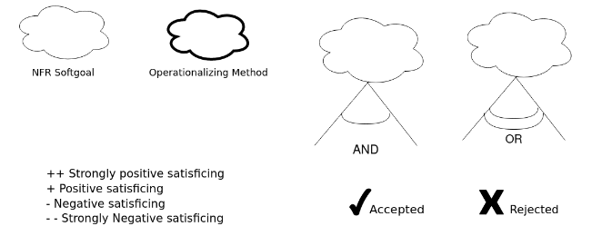
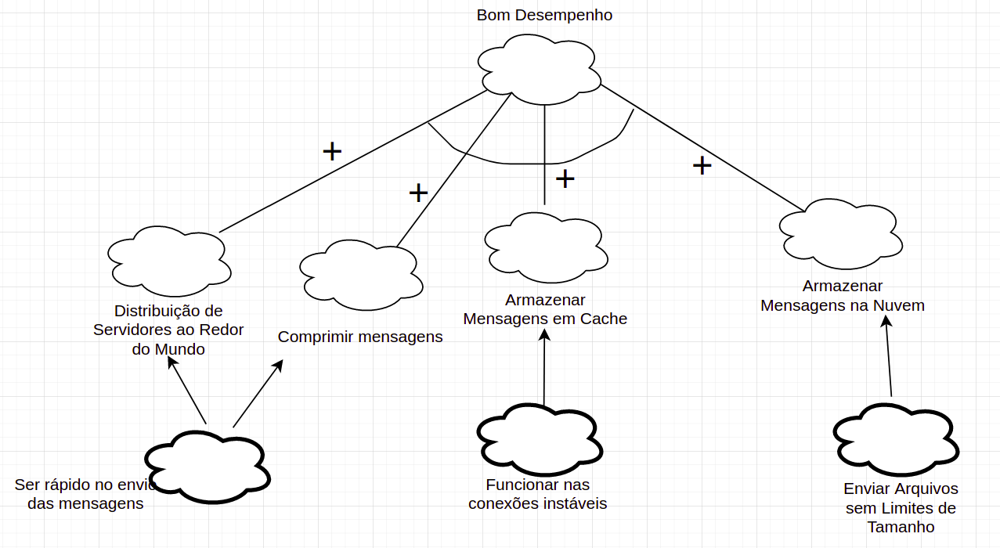
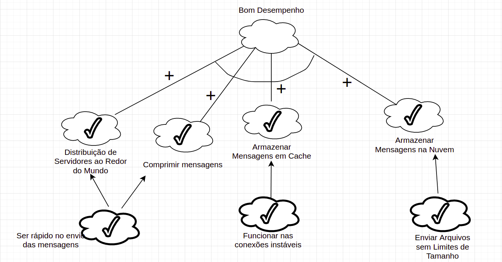
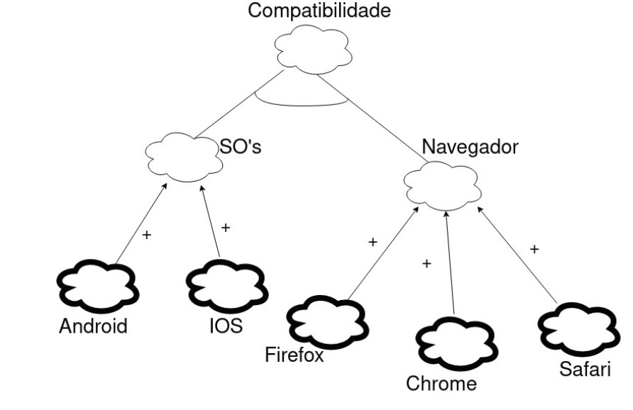
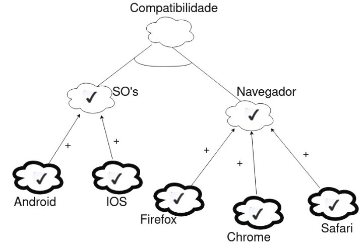
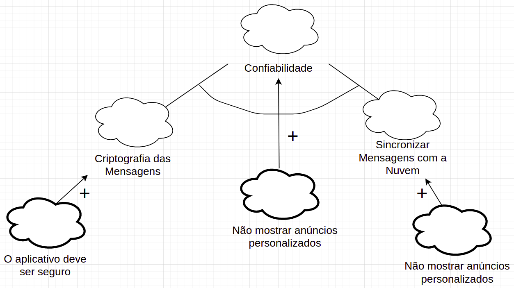
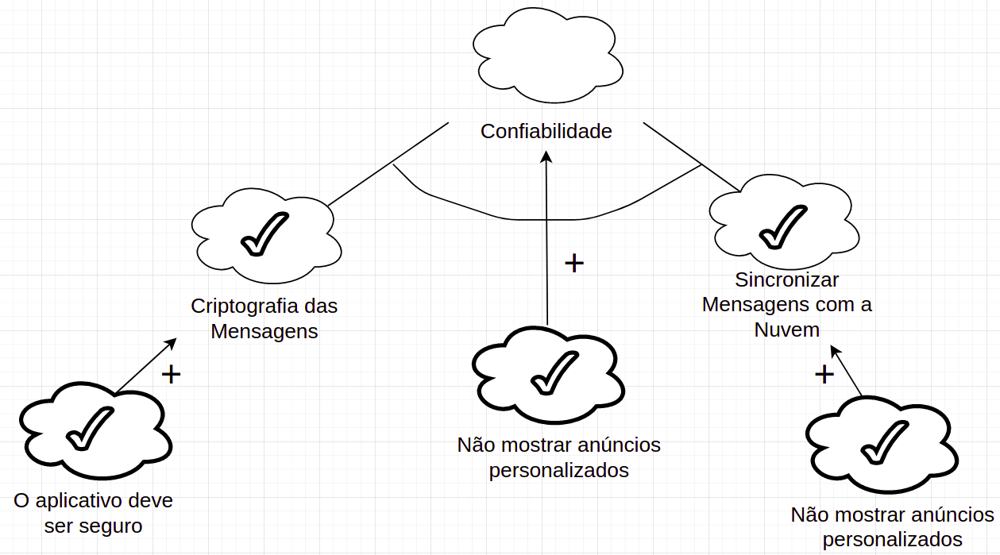
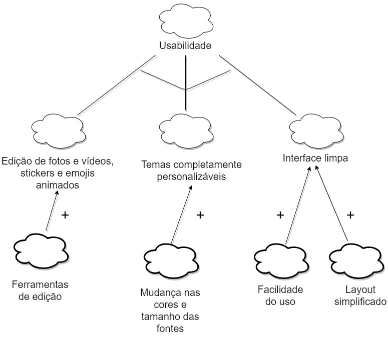
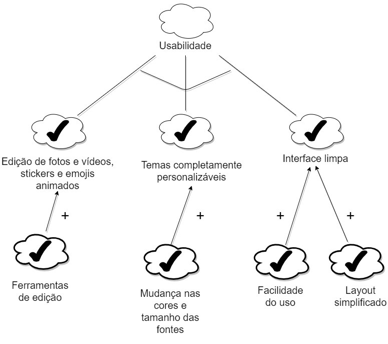

# NFR Framework

# Introdução

 &emsp; O NFR Framework é uma abordagem para representar e analisar Requisitos Não-Funcionais.
Seu objetivo é ajudar desenvolvedores na implementação de soluções personalizadas, levando em consideração as características do domínio e do sistema em questão. Tais características incluem Requisitos Não-funcionais, Requisitos funcionais, prioridades e carga de trabalho. Esses fatores determinam a escolha de alternativas de desenvolvimento para um determinado sistema (CHUNG et al., 2000). O modelo utilizado no NFR Framework é chamado Softgoal Interdependency Graph (SIG).

 &emsp; Foi utilizada a plataforma (inserir) para a criação dos NFR's e logo abaixo eles estão separados pelos tópicos: Usabilidade, Confiabilidade, Performance e Suportabilidade.

# Metodologia

 &emsp; Como explicado acima, neste documento estamos focados nos Requisitos Não-Funcionais. Para isso criamos alguns diagramas buscando atingir funcionalidades específicas , fazendo análise das possíveis situações, considerando as aplicações e tecnologias que já existem no aplicativo do Telegram.
 

# Requisitos não Funcionais

 &emsp; Abaixa estão os Requisitos não Funcionais levantados a partir da <a href="https://requisitos-de-software.github.io/2020.2-Telegram/modelagem/Especifica%C3%A7%C3%A3o_Suplementar/">Especificação Suplementar</a> e serão utilizados na vcriação do NFR Framework

|Número|Requisito|
|:---:|:-------:|
|RNF-01|O Telegram deve possuir ferramentas de edição de fotos e vídeos poderosas, stickers e emojis animados, temas completamente personalizáveis e uma plataforma de GIFs/stickers para fornecer toda expressão que o usuário precisar.|
|RNF-02|O aplicativo deve possuir uma interface limpa que seja tão simples que o usuário já saiba como usar.|
|RNF-03|O aplicativo deve providenciar a melhor segurança combinada com o uso fácil.|
|RNF-04|Tudo no Telegram incluindo conversas, grupos, mídias, etc deve ser fortemente criptografado utilizando a combinação simétrica AES de 256-bits, RSA 2048-bits e a troca de chaves seguras Diffie-Heelman.|
|RNF-05|O aplicativo deverá permitir a exclusão, para ambos os lados, de qualquer mensagem a qualquer momento e sem rastros por parte dos usuários.|
|RNF-06|O Telegram não utilizará os dados dos usuários para mostrar anúncios.|
|RNF-07|O aplicativo deve funcionar até nas conexões móveis mais instáveis.|
|RNF-08|O aplicativo deve ser o mensageiro mais rápido do mercado, conectando as pessoas através de diversos servidores ao redor do mundo.|
|RNF-09|O sistema deve estar disponível 24h por dia.|
|RNF-10|O aplicativo deve entregar as mensagens utilizando a menor quantidade de bytes possíveis.|
|RNF-11|O aplicativo deve permitir a criação de grupos com até 200 mil membros, a compartilhação de forma rápida de vídeos grandes, documentos de qualquer tipos de até 2GB cada, e definir bots para tarefas específicas utilizando a API.
|RNF-12|O aplicativo deve permitir o envio de mídias e arquivos sem qualquer limites de tamanho ou tipo. O histórico de conversas não precisará ocupar espaço em disco do dispositivo e deverá ser armazenado de forma segura na nuvem por quanto tempo o usuário precisar.|
|RNF-13|O usuário deve poder acessar as suas mensagens de todos os seus celulares, tablets e computadores ao mesmo tempo independente do navegador utilizado.|
|RNF-14|O aplicativo deve ser independente e permitir que o usuário não mantenha o celular conectado.|
|RNF-15|O Telegram deve possuir uma API completamente gratuita e documentada para desenvolvedores.|
|RNF-16|O aplicativo deve ter um design de alta compreensão e acessibilidade.|
|RNF-17|O aplicativo deverá possuir um código fonte aberto e builds verificáveis para provar que o app baixado foi construído usando exatamente o mesmo código fonte que é publicado.|
|RNF-18|Cores e contraste: o app deve possuir requisitos específicos para a personalização completa das cores no aplicativo, permitindo ser acessível a qualquer pessoa.|
|RNF-19|O aplicativo deve possuir ícones intuitivos e de fácil visualização para todos usuários e dispositivos.|
|RNF-20|O aplicativo deverá ter botões bem claros e com boa área de resposta ao clique/touch.|
|RNF-21|O aplicativo deve possuir alternativas aos elementos sonoros.
|
|RNF-22|O aplicativo deve conter sugestões visuais que garatam as informações das páginas ao usuário.|
|RNF-23|O aplicatido deve conter textos descritivos e bem dispostos na tela para melhor leitura dos usuários.|
|RNF-24|O aplicativo deve conter clareza nos links mostrados na tela ao usuário.|
|RNF-25|O espaço físico utilizado pelo Telegram deve ser o menor possível dentro de seu limite.|

# Legenda

<figcaption>Figura 1. Legenda do NFR Framework</figcaption>

# Suportabilidade
## Sem Propagação

<figcaption>Figura 2. Suportabilidade sem propagação</figcaption>

## Com Propagação

<figcaption>Figura 3. Suportabilidade com propagação</figcaption>

## Sem Propagação

<figcaption>Figura 4. Suportabilidade de sistemas e navegadores sem propagação</figcaption>

## Com Propagação

<figcaption>Figura 5. Suportabilidade de sistemas e navegadores com propagação</figcaption>

# Confiabilidade
## Sem Propagação

<figcaption>Figura 6. Confiabilidade do aplicativo Telegram sem propagação</figcaption>

## Com Propagação

<figcaption>Figura 7. Confiabilidade do aplicativo Telegram com propagação</figcaption>

# Usabilidade
## Sem Propagação

<figcaption>Figura 8. Usabilidade do aplicativo Telegram sem propagação</figcaption>

## Com Propagação

<figcaption>Figura 9. Usabilidade do aplicativo Telegram com propagação</figcaption>

# Referências Bibliográficas

- CHUNG, Lawrence; NIXON, Brian. Nixon, YU, Eric; MYLOPOULOS, John. "Non-Functional Requirements in Software Engineering". Springer US, 2000.
- SILVA, Reinaldo Antônio da. NFR4ES: Um Catálogo de Requisitos Não-Funcionais para Sistemas Embarcados. 2019

# Versionamento

|    Data    | Versão |                Descrição                 |  Autor(es)  |
| :--------: | :----: | :--------------------------------------: | :---------: |
| 01.04.2021 | 0.1    | Criação e adição de tópicos e Introdução | Ítalo Alves |
| 02.04.2021 |1.0   | Desenvolvimento do Documento | Ítalo Alves, Lucas Boaventura, Tiago Rodrigues |
