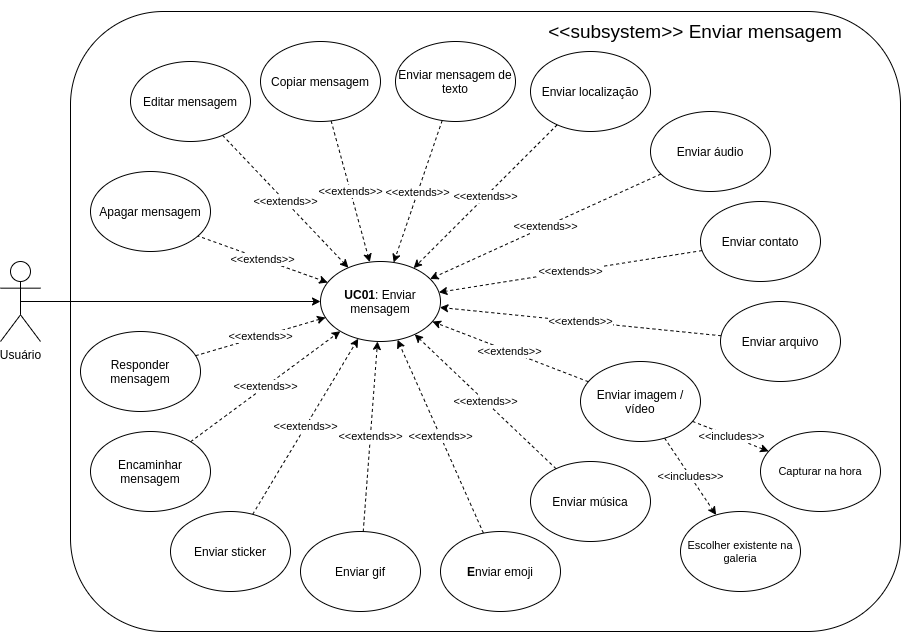
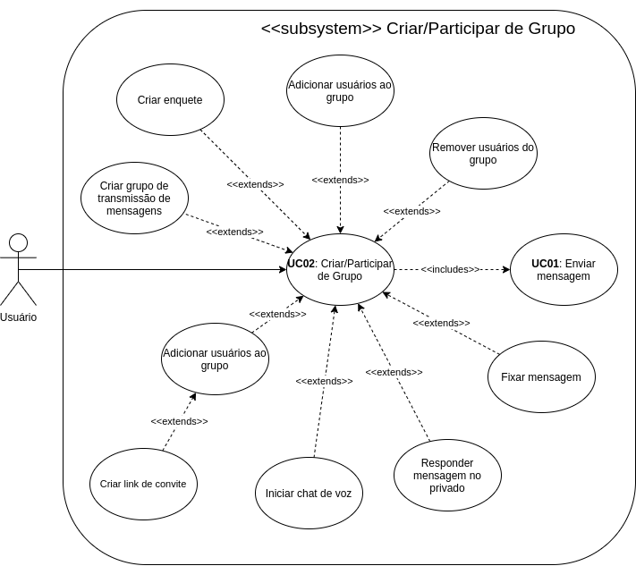
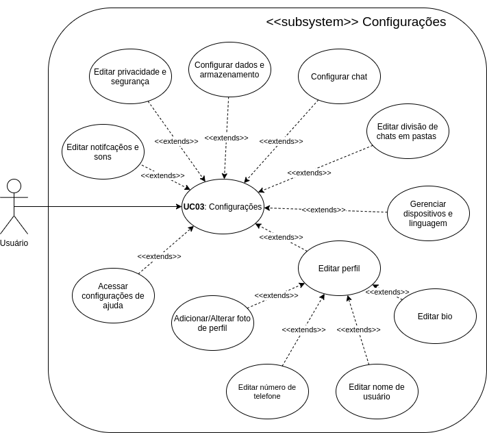
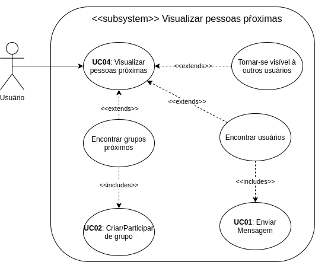

# Casos de Uso

## Introdução

 &emsp;Um caso de uso tem como função descrever como um ator/usuário realizará uma tarefa no sistema. Ele descreve, pelo ponto de vista do usuário, o comportamento do sistema conforme ele vai respondendo às solicitações. Cada caso de uso é representado como uma sequência de etapas simples, que começa com um objetivo/meta do usuário e termina quando este é concluido. Essas etapas são definidas a partir de um Diagrama de Casos de Uso, seguido pelas especificações dos casos, em que se é possível observar uma breve descrição e um fluxo de utilização do caso.

## Casos de Uso

#### UC01 - Enviar Mensagem

<figcaption>Figura 1. Imagem que ilustra o Casos de Uso ao enviar mensagem.</figcaption>

|   UC01   |  Informações  |
| ----------------- | ------- |
| Descrição | O usuário envia uma mensagem |
| Ator | Usuário |
| Pré-condições | Acesso à internet e estar logado no app |
| Ação | O usuário envia uma mensagem para outro usuário |
| Fluxo Principal | **FP01:** Fluxo de enviar mensagem para um usuário que o ator já interagiu   1. O ator entra no aplicativo   2. O sistema exibe uma lista de conversas recentes   3. O ator procura pelo usuário que deseja conversar   4. O ator clica sobre o chat desse usuário   5. O ator digita/seleciona um dos diferentes tipos de mensagens   6. O ator clica no botão de enviar |
| Fluxo Alternativo | **FA01:** Fluxo de enviar mensagem para um novo usuário   1. O ator entra no aplicativo   2. O ator clica no botão flutuante no canto inferior direito   3. O sistema exibe a lista de contatos   4. O ator procura pelo contato que deseja iniciar uma conversa   5. O ator clica sobre o contato desse usuário   6. O ator digita/seleciona um dos diferentes tipos de mensagens   7. O ator clica no botão de enviar |
| Pós-condições | O ator poderá utilizar os chats com seus contatos |
| Rastreabilidade | Requisitos Funcionais 1-6, 13-16, 35-38, 43-44 do [documento final de elicitação](https://requisitos-de-software.github.io/2020.2-Telegram/elicitacao/Resultado_e_Prioriza%C3%A7%C3%A3o/resultado/) |

#### UC02 - Criar/Participar de Grupo

<figcaption>Figura 1. Imagem que ilustra o Casos de Uso ao criar/participar de umgrupo.</figcaption>

|   UC01   |  Informações  |
| ----------------- | ------- |
| Descrição | O usuário cria ou participa de um grupo |
| Ator | Usuário |
| Pré-condições | Acesso à internet e estar logado no app |
| Ação | O usuário cria/participa de um grupo |
| Fluxo Principal | **FP01:** Fluxo de criar um grupo de mensagens pela tela principal   1. O ator entra no aplicativo   2. O ator clica no botão flutuante no canto inferior direito   3. O sistema exibe uma lista de opções   4. O ator clica sobre a opção "Criar Grupo"   5. O ator seleciona os contatos que deseja adicionar ao grupo   6. O ator adiciona um nome e uma imagem ao grupo   7. O ator clica no botão inferior direito para criar o grupo   8. O ator pode realizar as diversas funções relacionadas ao grupo |
| Fluxo Alternativo | **FP01:** Fluxo de criar um grupo pela menu lateral   1. O ator entra no aplicativo   2. O ator clica no botão superior esquerdo   3. O sistema abre o menu lateral   4. O ator clica sobre a opção "Criar Grupo"   5. O ator seleciona os contatos que deseja adicionar ao grupo   6. O ator adiciona um nome e uma imagem ao grupo   7. O ator clica no botão inferior direito para criar o grupo   8. O ator pode realizar as diversas funções relacionadas ao grupo |
| Pós-condições | O ator terá um grupo de mensagens criado |
| Rastreabilidade | Requisitos Funcionais 11-12 do [documento final de elicitação](https://requisitos-de-software.github.io/2020.2-Telegram/elicitacao/Resultado_e_Prioriza%C3%A7%C3%A3o/resultado/) |

#### UC03 - Configurações

<figcaption>Figura 1. Imagem que ilustra o Casos de Uso ao acessar as configurações do aplicativo.</figcaption>

|   UC01   |  Informações  |
| ----------------- | ------- |
| Descrição | O usuário configura o aplicativo |
| Ator | Usuário |
| Pré-condições | Estar logado no app |
| Ação | O usuário edita as configurações do aplicativo |
| Fluxo Principal | **FP01:** Fluxo de editar o perfil   1. O ator entra no aplicativo   2. O ator clica no botão superior esquerdo    3. O sistema abre o menu lateral   4. O ator clica na opção de "Configurações"   5. O sistema lista as opções de configuração   6. O ator seleciona uma opção da primeira seção (Conta)   7. O ator altera uma informação do seu perfil |
| Fluxo Alternativo | **FP01:** Fluxo de editar outras configurações do app   1. O ator entra no aplicativo   2. O ator clica no botão superior esquerdo    3. O sistema abre o menu lateral   4. O ator clica na opção de "Configurações"   5. O sistema lista as opções de configuração   6. O ator seleciona uma opção da segunda seção (Configurações)   7. O ator configura uma informação relacionada ao aplicativo |
| Pós-condições | O ator terá suas configurações atualizadas |
| Rastreabilidade | Requisitos Funcionais 22, 29 do [documento final de elicitação](https://requisitos-de-software.github.io/2020.2-Telegram/elicitacao/Resultado_e_Prioriza%C3%A7%C3%A3o/resultado/) |

#### UC04 - Visualizar Pessoas Próximas

<figcaption>Figura 1. Imagem que ilustra o Casos de Uso ao visualizar pessoas próximas.</figcaption>

|   UC01   |  Informações  |
| ----------------- | ------- |
| Descrição | O usuário visualiza pessoas próximas a ele no aplicativo |
| Ator | Usuário |
| Pré-condições | Acesso à internet e estar logado no app |
| Ação | O usuário encontra pessoas próximas a ele |
| Fluxo Principal | **FP01:** Fluxo encontrar usuários próximos e iniciar um conversa   1. O ator entra no aplicativo   2. O ator clica no botão superior esquerdo    3. O sistema abre o menu lateral   4. O ator clica na opção de "Pessoas Próximas"   5. O sistema lista na primeira seção uma lista de pessoas próximas ao ator   6. O ator clica sobre um usuário   7. O ator clica no botão de enviar uma mensagem para o usuário |
| Fluxo Alternativo | **FP01:** Fluxo de tornar-se visível para outros usuários   1. O ator entra no aplicativo   2. O ator clica no botão superior esquerdo    3. O sistema abre o menu lateral   4. clica na opção de "Pessoas Próximas"   5. O ator clica sobre a opção de "Ficar Visível"     **FP02:** Fluxo de participar de um grupo local   1. O ator entra no aplicativo   2. O ator clica no botão superior esquerdo    3. O sistema abre o menu lateral   4. clica na opção de "Pessoas Próximas"   5. O ator navega até a seção "Grupos Próximos"   6. O ator clica sobre um grupo local que deseja participar   7. O sistema exibirá o grupo selecionado   8. O usuário clica no botão inferior "Entrar" e começa a participar do grupo |
| Pós-condições | O ator encontrará pessoas e grupos próximos a ele |
| Rastreabilidade | Requisito Funcional 26 do [documento final de elicitação](https://requisitos-de-software.github.io/2020.2-Telegram/elicitacao/Resultado_e_Prioriza%C3%A7%C3%A3o/resultado/) |

## Bibliografia
- Use Cases. usability.gov. Disponível em: https://www.usability.gov/how-to-and-tools/methods/use-cases.html. Acesso em: 22 de mar. de 2021.

## Versionamento
|   Data     | Versão |        Descrição             |     Autor(es)    |
| :--------: | :----: | :--------------------------: | :--------------: |
| 24/03/2021 |  0.1   | Criação dos Casos de Uso     | Hérick Portugues |
| 25/03/2021 |  1.0   | Desenvolvimento do documento | Hérick Portugues |
| 25/03/2021 |  2.0   | Revisão do documento e adição de descrição das imagens | Lucas Boaventura |