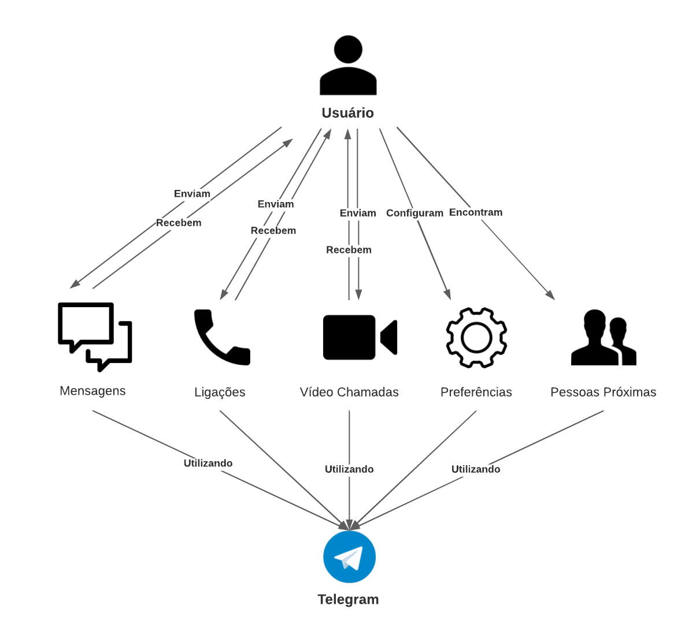
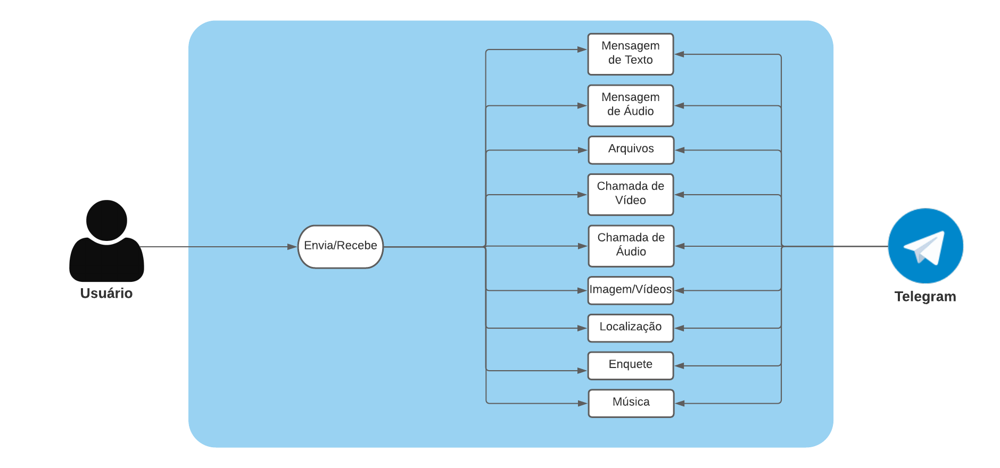

# Rich Pictures

## 1. Introdução

O Rich picture é uma maneira efetiva de analisar problemas e expressar ideias através de diagramas gráficos. Ele ajuda a explorar e representar um sistema e suas interações com os diferentes atores e dados envolvidos, criando um diagrama mental preliminar.

## 2. Rich Pictures

### 2.1 Rich Picture Geral

### 2.1 Rich Picture Comunicação

## 3. Versionamento

| Data       | Versão | Descrição                    | Autor                |
| ---------- | ------ | --------------------------   | ---------------------|
| 18/02/2021 | 1.0    | Desenho dos Rich Pictures    | Todos os Integrantes |
| 20/02/2021 | 1.1    | Desenvolvimento do documento | Hérick Portugues     |
